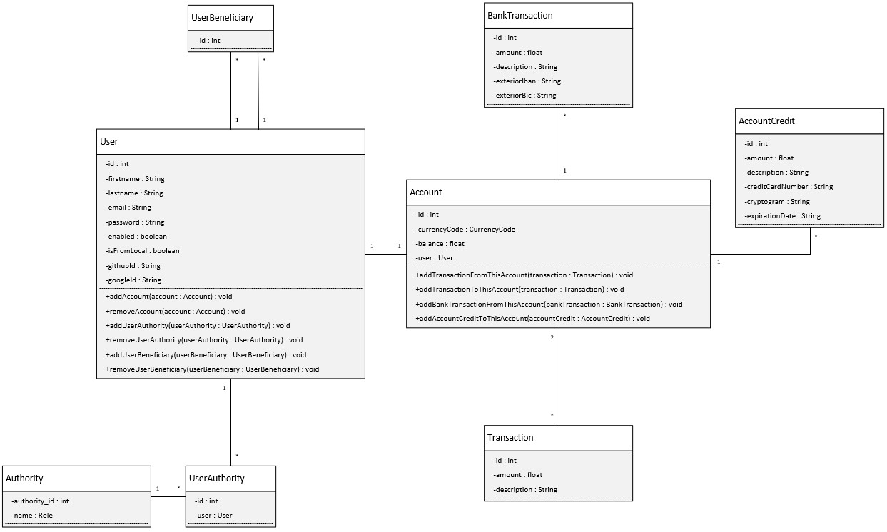

# README

This app is an exercise about creating a template app to make money transaction between buddies. 
The point here is to create the frontend and the backend (i.e. db construction). 
Nothing is set in place to make real financial transaction.

## Before use
1. Read Database documentation
2. Read application.properties documentation

## Database documentation
### Main database : paymybuddy

This app uses a MySQL DB. Here are some information about how to install this DB. 

1. Download and install MySQL : https://dev.mysql.com/downloads/installer/
2. Record carefully your RootUsername and password to this DB.
3. Open a command prompt :
   1. type in and press ENTER: mysql -u 'yourRootUsername' -p
   2. write down your password when asked and press ENTER
   3. type in and press ENTER : CREATE DATABASE paymybuddy;
   4. type in and press ENTER : exit
   5. locate both data.sql and schema.sql. They are normally inside resources file of this project.
   6. Go back to your prompt and type in + Enter :
      1. mysql -u username -p database_name < {full path to schema.sql}
   7. You are now good to go, and have correctly initialised your database

### Test database : paymybuddytest
1. Open a command prompt where createTestUser.sql is located (normally in tests resources) :
   1. type in and press ENTER: mysql -u 'yourRootUsername' -p
   2. write down your password when asked and press ENTER
   3. type in and press ENTER : CREATE DATABASE paymybuddytest;
   4. type in and press ENTER : exit
   5. type in : source createTestUser.sql
   6. press ENTER.
   7. Enjoy !

## Application.properties documentation

This file is located in src/main/resources. 
It is used to give properties to the spring boot application.
In this project there is already one called application.example.properties.
1. If you want to use this app through it sources files:
   1. Duplicate application.example.properties and rename it application.properties. Make sur it is located in src/main/resources
   2. add the correct values for each property :
      1. spring.datasource.username
      2. spring.datasource.password
      3. spring.datasource.url
      4. spring.jpa.properties.hibernate.dialect
      5. All the entries concerning ### OAuth2.0 ###
2. If you use the jar file:
   1. Create a /config directory in the root directory where the jar is located.
   2. add application.properties in this /config directory
   3. follow steps above to configure application.properties
   

Enjoy !

## Diagrams
### UML diagram

### PDM diagram
